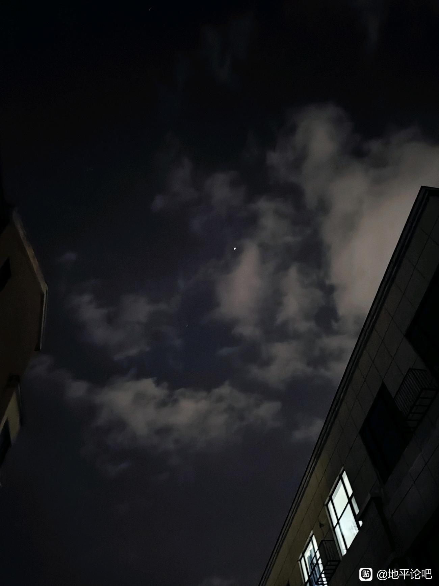
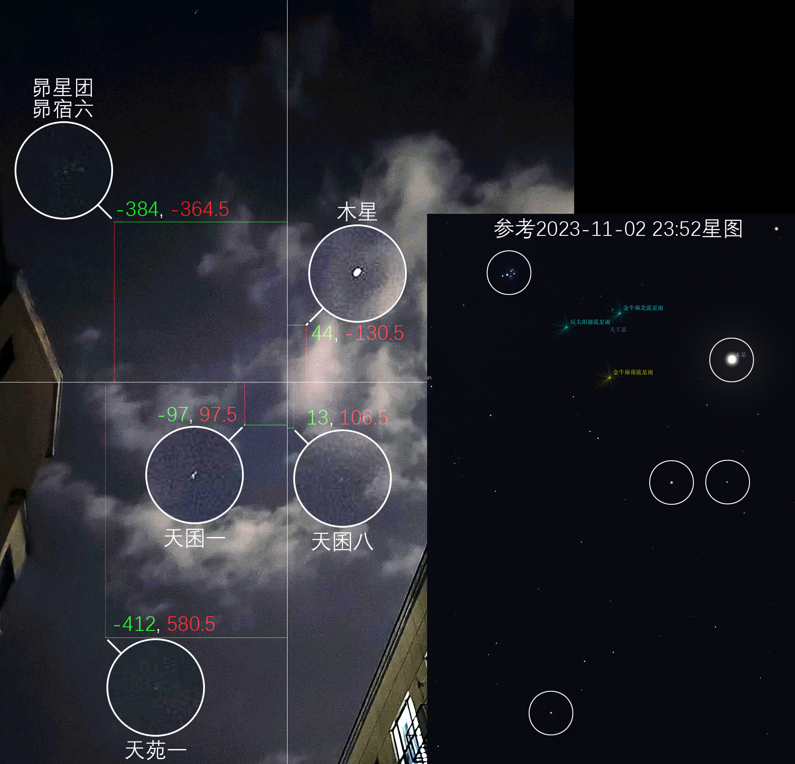
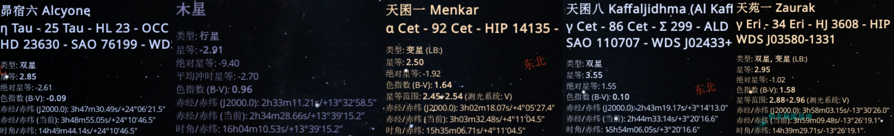
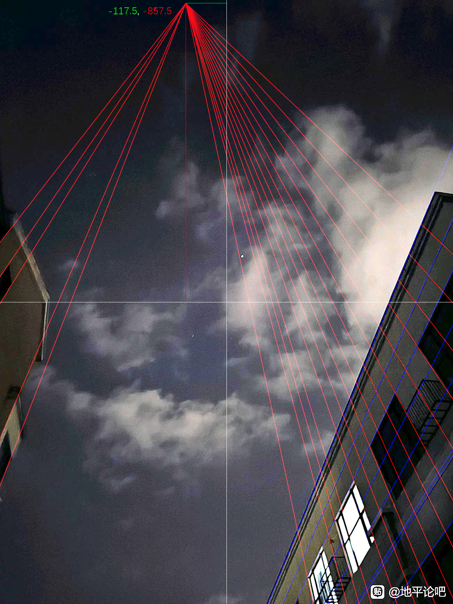

# 照片测星定位

> 就像每个星星都有自己的位置，每个人也都有自己的轨迹。
> ——ChatGPT瞎编的

## 作者

[MC着火的冰块](https://space.bilibili.com/551409211)

## 原理

[从一张星空照片定位出拍摄地是真的还是假的？](https://www.bilibili.com/video/BV1Dx4y117yM)

[照片测星定位法原理简介及实例示范](https://tieba.baidu.com/p/8724702347)

## 当前项目进度

- [x] 照片上的天体辨识和测量
- [x] 像素焦距
- [x] 天顶位置确定
- [ ] 定位计算

## 使用方法

使用`-h`参数获取帮助

```commandline
pap -h
pap mark -h
...
```

下面以`test/1.jpg`为例进行演示（拍摄时间2023-11-02 23:52）



### 1. **照片上的天体辨识和测量**

在照片上标记星星的名字和坐标（**以图片正中心为原点**）



在星图软件中查找出**0°,0°处，拍摄时**它们的时角和赤纬



| 星星  | x    | y      | 时角           | 赤纬           |
|-----|------|--------|--------------|--------------|
| 昴宿六 | -384 | -364.5 | 14h49m44.14s | +24°10'46.5" |
| 木星  | 44   | -130.5 | 16h04m10.53s | +13°39'15.2" |
| 天囷一 | -97  | 97.5   | 15h35m06.71s | +4°11'04.5"  |
| 天囷八 | 13   | 106.5  | 15h54m06.05s | +3°20'16.6"  |
| 天苑一 | -412 | 580.5  | 14h39m29.71s | -13°26'19.1" |

记录完后，运行：

```commandline
pap mark -j data.json
```

按要求输入数据即可，输入信息和计算得到的GP会写入`data.json`中

或者先将其以**以下格式**整理进一个文件：

```text
| 昴宿六 | -384 | -364.5 | 14h49m44.14s | +24°10'46.5" |
| 木星  | 44   | -130.5 | 16h04m10.53s | +13°39'15.2" |
| 天囷一 | -97  | 97.5   | 15h35m06.71s | +4°11'04.5"  |
| 天囷八 | 13   | 106.5  | 15h54m06.05s | +3°20'16.6"  |
| 天苑一 | -412 | 580.5  | 14h39m29.71s | -13°26'19.1" |
```

然后运行：

```commandline
pap mark -j data.json -r test/stars.txt
```

### 2. **天顶位置确定**

先将照片中指向天顶的直线用红色、绿色或蓝色（推荐绿色）标注出来


~~up装不起PS，用这个替代一下（逃~~

然后运行：

```commandline
pap zenith test/lines.jpg --colour=red -j data.json
```

（由于nuitka的bug，`-c`的缩写在可执行文件上无法使用）

程序会很快计算出距离这些直线总距离最近的点并写入`data.json`

### 3. **像素焦距**

请确保[第一步](#1-照片上的天体辨识和测量)已经完成

运行：

```commandline
pap z -j data.json
```

使用二分法进行查找，误差控制在1e-3以内，速度很快，所以不需要C++加速
